# Market Lifecycle

Every Strike market follows this flow from creation to payout.

## Flow Diagram

```mermaid
flowchart TD
    A["🏗️ Keeper Creates Market\n(at :00/:05/:10 etc)"] --> B["📖 OPEN\nAccepting bets"]
    
    B -->|"Users bet UP ⬆️ or DOWN ⬇️\n(0.001+ BNB each)"| B
    B -->|"Halfway point reached\n(2.5 min for 5-min market)"| C["🔒 LOCKED\nNo more bets"]
    
    C -->|"Market expires\n(5 min from creation)"| D{"🔮 Keeper Resolves\nwith Pyth price"}
    
    D -->|"Both sides have bets\n& no exact tie"| E["✅ RESOLVED"]
    D -->|"One-sided pool\nOR exact price tie"| F["❌ CANCELLED"]
    
    E --> G{"Did you win?"}
    G -->|"✅ Yes"| H["💰 Claim Winnings\n(your bet + share of losing pool\nminus 3% fee)"]
    G -->|"❌ No"| I["😢 Better luck\nnext time"]
    
    F --> J["🔄 Refund\n(everyone gets their bet back)"]
    
    D -->|"24h passes\nwithout resolution"| K["⏰ Auto-Cancelled\n(deadline passed)"]
    K --> J

    style A fill:#4a9eff,color:#fff
    style B fill:#22c55e,color:#fff
    style C fill:#f59e0b,color:#fff
    style E fill:#22c55e,color:#fff
    style F fill:#ef4444,color:#fff
    style H fill:#a855f7,color:#fff
    style J fill:#6366f1,color:#fff
    style K fill:#ef4444,color:#fff
```

## Timeline (5-minute market)

## Key Rules

| Rule | Detail |
|------|--------|
| **Minimum bet** | 0.001 BNB |
| **Trading stops** | Halfway through duration (2.5 min for 5-min markets) |
| **Anti-frontrun** | Last 60s before expiry: no bets accepted |
| **Protocol fee** | 3% of the losing pool (winners keep their own bets + winnings minus fee) |
| **One-sided refund** | If all bets are on one side, everyone is refunded |
| **Exact tie refund** | If resolution price = strike price exactly, everyone is refunded |
| **Auto-cancel** | If no one resolves within 24h, market cancels and refunds are available |
| **Early bird bonus** | Earlier bets get up to 2x shares (multiplier decreases linearly to 1x at trading deadline) |
